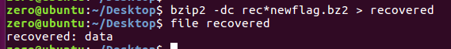

Gynvaels 24th mission involves extracting information from a seemingly corrupted .bz2 file!

First thing's first, never trust file extensions:

.. Ok fine gynvael was telling the truth.
Let's see what happens when we try to extract whatever's in there..

OOOOOKK. It spent a long time trying to extract and then it ran out of disk space.
Let's naively ignore this pretty specific error (because I CTRL+C'd well before seeing this the first time),
and try to bzip2recover the file to fix it up.

So the bzip file has so many blocks that bzip2recover can't even support it?
This is a big file. or is it?
Let's hexdump it..

Ok so as I kind of displayed, each compressed block starts with "1AY&SY".
This is followed by some more block specific information, and the compressed data is at the end of the block.

Just quickly eyeballing the end of each block shows that each block is pretttttty much identical.

I'm feeling like this file is just the same thing over and over and over but compressed.

On a whim I decided that an easy way to cut down the block size would be to just grab the head and tail of the file and put them into a new bzip file. The middle parts I cut out might not matter that much since it's just the same blocks over and over.

The worst that happens is I fail and go back to square one, so let's try it.

Let's grab the first 100 lines of the file and the last 100 lines of the file and make a new file with them..

Now if we just try to decompress this new file it will fail because the CRC check for the whole stream will be out.
Atleast I assume that's why it fails.
So let's fix the new file will bzip2recover..

COOL!
reducing the number of blocks means we dont fail anymore.
Now lets assemble all the blocks back into a decompressed data file with bzip2..

*crosses fingers*

GynFlag{NextTimeTheFileWillBeEvenBigger!}

WOOHOO!
Solved!
I have no idea if this was the intended method, but a win is a win

